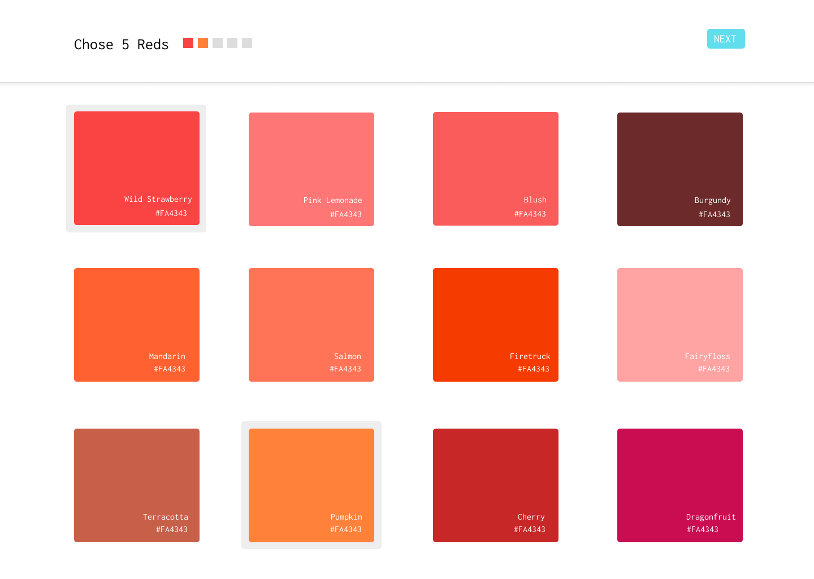
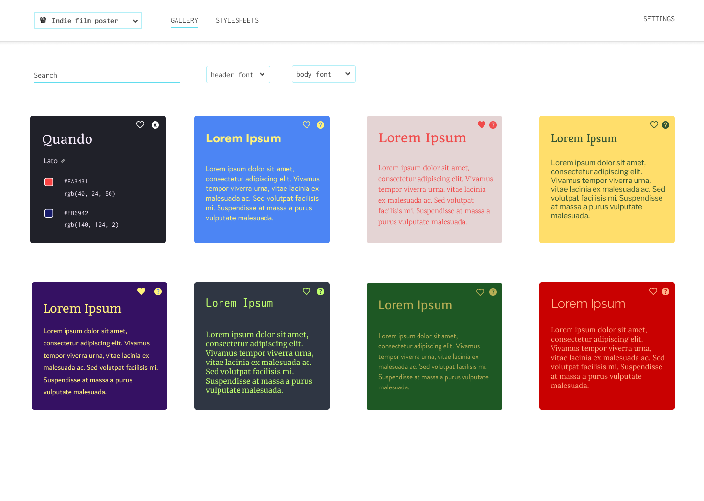
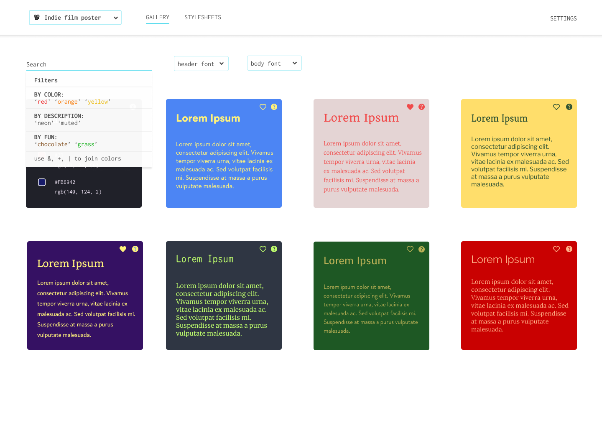
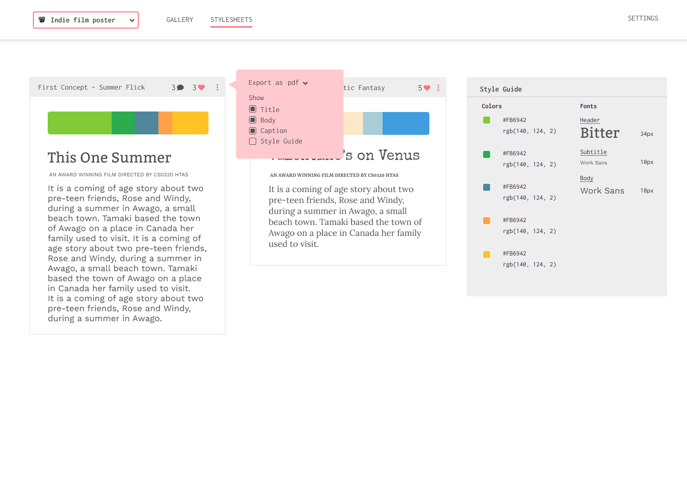

# cs0320 Term Project 2020

## INFO

[Official README](https://powerful-forest-21960.herokuapp.com/about) /
[Deployed App](https://powerful-forest-21960.herokuapp.com/) /
[Figma Mocks](https://www.figma.com/file/5qDBB51FS1zYHBRXRJjSVm/Gooey?node-id=0%3A1)

## Set Up

### To develop:

In the `backend` directory, you will need to create your venv.

**For Macs:**  
`python3 -m venv venv` 
`. venv/bin/activate`  
or `source venv/bin/activate`  
`pip install flask python-dotenv firebase_admin`

NEW： Run `gunicorn run:app` in the root directory to run the app on port 8000.
You'll need to go into `frontend/src/constants.js` and comment in the 8000 variable to see
changes in the front end.

**For Windows:**  
`py -m venv venv` 
`source venv/Scripts/activate` 
`pip install flask python-dotenv firebase_admin`

In the future, if you need to add more modules, you will need to activate your <tt>venv</tt> and <tt>pip install</tt> them.

Once finished, you should just be able to run
`flask run`
and see that the Flask app is running on port 5000.

To end the server, use CNTRL+C. 

To exit your venv, type
`deactivate`

NEW (untested sorry Minna) for windows： Run `flask run` in the root directory to run the app on port 5000.
You'll need to go into `frontend/src/constants.js` and comment in the 5000 variable to see
changes in the front end.

** stuff **
If you want to install all dependences, go to the 
root directory and go: `pip install -r requirements.txt`

### To Test:

Step 1) In the `backend` directory, activate the virtual environment and run Flask server 

For Mac: `. venv/bin/activate` , then
`flask run`

For Windows:
`py -m venv venv` , then
`flask run`

Step 2) Make sure that nose2 is installed (`pip install nose2`). In another terminal, go to the `backend` directory,
activate the virtual environment (like above) and run all tests using nose2.

For Mac: `. venv/bin/activate` , then
`nose2 -v`

For Windows:
`py -m venv venv` , then
`nose2 -v`

 
 IN SUMMARY: you will need two terminals on the virtual environment in which one runs the flask server
 and the other runs the tests via nose2. 

# cs0320 Project Proposals

**Team Members + Strengths & Weaknesses** 

Anna
* Strengths: Data analysis in Python, Algorithms
* Weaknesses: Back-end, Multithreading

Minna
* Strengths: Making SVG graphics in Adobe Illustrator, D3, MongoDB
* Weaknesses: Concurrency, Authentication

YJ
* Strengths: Web-dev, Node
* Weaknesses: Multithreading, Networking

Katherine
* Strengths: React,  SQL
* Weaknesses: Dynamic Programming, Multithreading

 
***Note: We want to make our front end in React, so if we could request a project mentor that has experience combining a Java backend with React, that would be amazing!**

---

**Project Idea(s):** 

### Project 1: Pigma (Name in Progress)
_Resubmission approved_

#### Overview:
Style guides are an ubiquitous part of the design process — used in graphic design, marketing & PR, and product/UI design. 
Although there are multiple applications such as [Figma](https://www.figma.com/) and Adobe
 InDesign available to graphic designers, there isn’t an efficient way to create multiple style guides while planning a project — often, you’ll have to reference multiple resources
  (ex. start at [Google fonts](https://fonts.google.com/) for typefaces, [Coolors](https://coolors.co/) for palettes
  , then Figma to pull it all together) to create a stylesheet.
   Furthermore, these websites often don’t foster discovery, leading designers to go back to their go-to fonts that they know will “work”.

On a high-level, we want to build an application that streamlines the prototyping process by giving users access to a
 gallery of design cards generated based on their preferences, from which they can create multiple “style sheets.” Users 
 in a project workspace can access all the style sheets, collaborate, and vote on their favorite styles. Furthermore, our 
 application will be able to support a multitude of filtering methods, such as being able to filter design cards in broader 
 categories such as “warm colors” to more specific categories like “neon blue.”

When logging in to our webapp for the first time, we envision the user choosing between 25 and 50 colors 
that they like to get an idea of their color preferences. There are plenty of color APIs or datasets for us to accomplish this, such as [ColorAPI](https://www.thecolorapi.com/) or this massive [color dictionary](https://github.com/meodai/color-names). We would then build and train
a neural network on these inputs, which can be accomplished through the [synaptic](https://github.com/cazala/synaptic) library, and use the result to generate design cards according to user input.
  
||
|:--:| 

After indicating their preferences, the user will be able to infinitely scroll on the gallery page to browse the generated design cards. All design cards will be two-color and two-font combinations. Additionally, on this page, users will have the ability here to sort the design cards by categories such as “warm”, “cool”, “neon”, and more, through a search bar on the top of the page.   

||
|:--:| 

||
|:--:| 

If the user sees a card that they particularly like, they will be able to add the design card to their workspace. In the style guide workspace, users have the ability to adjust the color palette on the style sheet, toggle text elements they want, and [change the font](https://developers.google.com/fonts/docs/developer_api) of text elements. The basic style sheet will have the default elements title and body, but users will be able to toggle elements such as subtitle and link. Users will be able to maintain and edit multiple style guides in their workspace so that they can compare alternative options for their project. The visual of the workspace is depicted below:

&nbsp;
&nbsp;
&nbsp;

||
|:--:| 
| *The rightmost element is an example of a stylesheet for "This One Summer."* |

**Requirements:**
* A gallery page showing the user an infinite list of design cards.
* An input element that allows users to filter design cards by search criteria.
* A workspace page where users can create and edit style sheets, with options to change colors and fonts, as well as add font elements.

**Algorithmic Challenges:**
* Our key algorithmic challenge is creating a neural network that can generate aesthetically appealing color combinations based on user input, and figuring out how to represent this model in the database, given that the outputs will be infinite. Additionally, optimizing this training such that the user does not have to wait an absurd amount of time to generate their design cards.
* Likewise, we are open to finding another way to create an algorithm to map color recommendations, if deep learning is too heavy handed and unfeasible for a web app. Another idea we are considering is scraping human-curated and created palettes, such as from [color hunt](https://colorhunt.co) and using this data to create a graph-like structure that could represent a color space where optimal color combinations of a certain distance from each other. We have read a few papers such as [ColorMoo](https://scholarship.claremont.edu/cgi/viewcontent.cgi?referer=https://www.google.com/&httpsredir=1&article=1881&context=cmc_theses)  that stipulate on how user input can affect color palette generation, but this route would require some research and experimentation.
* Finding a way to filter colors based on categories such as “warm,” “neon,” and “blue,” et cetera, since this information is not encoded in colors. We also want to support complex filtering on multiple criteria such as “neon blue.”

**Additional Features:**
* Design with accessibility in mind: We want to have a mode on each style sheet, where the user can toggle to “color blindness” mode to see how their style guide appears to people with different kinds of color blindness.
* Exporting stylesheet: Ability to export the style sheet in either PDF / SVG / PNG formats.
* Collaborative Workspaces: you can see people editing and voting for stylesheets in real time, or adding comments to stylesheets.
* Ability to undo and redo recent changes on a stylesheet.
* Ability to toggle night mode.

**Timeline:**
* There are two main components: Generating the gallery page, and then creating the workspace page. We plan to be spending two weeks (including spring break) developing the model architecture and integrating it with a database. We will spend April developing the front-end, search mechanics, and style-sheet functionality.

---

### Project 2: Collaborative Art Boards (Revised)
_Unsure - it's a fun idea with real challenges, but there is no core algorithm_

*Overview:* The nostalgic days of iScribble (circa early 2000s internet aesthetic) are over, but collaborative drawing is well and alive! This idea is a web app where users can create boards and make collaborative art (most likely pixel art / low res art). Each board can be a different room. We want a chat function that can function also as a “repl” for the art board -- for instance, the owner of the board can type (username, undo) to undo that user’s last function. Another jumping point for this idea is to have the moderator create different rules for the room, such that it can become a game, like pictionary, pixel art competitions, drawing with a limited color palette,  or one collaborative board.

Requirements:
* Users enter a room with a specific theme and are able to collaboratively make art in the room.
* Supports various administrative commands/features within each room, such as moderators, erasing the changes made by a particular user, etc.
* Various tools such as pen tool, line tool, color picker, blend tool should be available.
* Supports a public and private chat feature, where users can publicly chat in a room or “whisper” (direct message) a single user
* Each account has a gallery which stores the boards the user has participated in, the user’s private boards, the user’s friends.
* *Edit* While drawing the board, there will be filters that users can use to adjust the image. The user can "lasso" part of their image and apply filters, such as blur, heightening contrast, saturation, and luminescence. These can be done with algorithms such as convolution that we would implement from scratch.

Technical Challenges:
* Potentially support a framework where users can design their own rules (according to set constraints) and have games played according to these rules
* Manage concurrency such that all users can see other users drawing in real-time.

---

### Project 2: Multilingual Scattergories
_Rejected - There is no algorithm and it would be really hard to get this right_

*Overview:* Language learning applications such as Duolingo, Lingvist, and Memrise are great for introducing users to a language, but they lack a core part of language learning: generative learning. Multilingual scattergories is an online game where intermediate learners can join an online community and practice their language skills! Users can join a “game room” of a selected language, and partake in a game of scattergories. The game works like this: users in a game room are given a category [and a letter, if it’s a Romance language]. Then, they have an allotted time to type as many words in that language as possible. At the end, whoever has the most number of valid and unique words (if two users have the same word, it won’t count) wins.

Requirements:
* Game functionality (ability to play a game with a timer and multiple users live)
* Support for multiple languages (a way to classify if user inputs are a valid input in that category)
* Visualization (UI + Game Statistics)

Technical Challenges:
* Multi-user chat interactions
* Evaluating valid words (for example, how do we know that “Dog” is a valid word for the category “Animal” in all languages)

---

### PROJECT 3: Smoothie Mixer Game
_Unsure - This is a really fun idea and I'm sure you could come up with an algorithm but there isn't really one here yet_

Overview: Games are fun! Smoothies are delicious! Color theory can be boring to learn, and color theory isn’t very accessible.  Inspired by the color blindness mode of the color palette generating app, [Coolors](https://coolors.co/), this is a playful web app where users can make virtual smoothies and learn color theory. We note that the purpose of the game isn’t to solely learn color theory, but to make a color-based game that is accessible to all.

Requirements:
* Users should each be able to build a smoothie by dragging and dropping fruits of different colors
* Users enter a game room where they can compete with other users
* The rounds should be timed and there should be a “goal color” that all users are trying to achieve
* When the round ends, the user who created the closest hue is the winner
* With winning, users can “buy” seasonal fruits to compete in future smoothie competitions
* Potentially a game mode where users experience what a person with color blindness would see.
* Make the game accessible to those with color blindness.
* Potentially a reward store and a currency for the game,  where users can buy seasonal fruits and vegetables so they have more options to make their smoothies.
* Users can export their recipes for good memories :’) 

Technical Challenges:
* Accessibility to different kinds of color blindness, and for non-colorblind users to play in color-blind modes
* Generating “good” color goals and calculating which player’s color was the closest
* Creating delightful graphics that make the product something that people want to use

**Mentor TA:** _Put your mentor TA's name and email here once you're assigned one!_

## Meetings
_On your first meeting with your mentor TA, you should plan dates for at least the following meetings:_

**Specs, Mockup, and Design Meeting:** _(Schedule for on or before March 13)_

**4-Way Checkpoint:** _(Schedule for on or before April 23)_

**Adversary Checkpoint:** _(Schedule for on or before April 29 once you are assigned an adversary TA)_

## How to Build and Run
_A necessary part of any README!_
 
